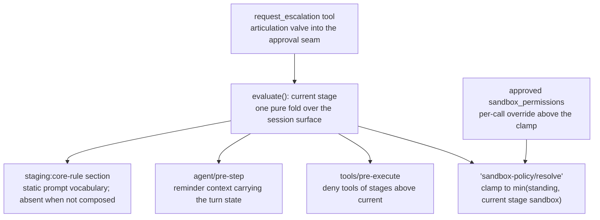
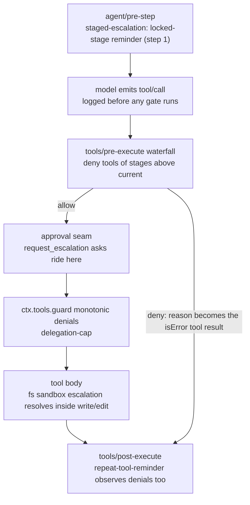

# Agent Note: Staged escalation compiles a GatedEscalation ladder into four seam injections over one turn fold

Status: proposed

## Problem

Every user turn starts with the full request tool catalog, and the shipped gates restrict on axes other than deliberation order: fs sandbox modes and the approval policy restrict blast radius, and plan mode changes only a prompt section while the catalog stays whole by its own module doc. Given an ambiguous prompt, the model can therefore spend an entire turn on write- or execute-tier calls built on an unverified premise; the reported failure mode is a tens-of-minute write spree that reads no file and asks no question and ships nothing. Soft guidance — the core prompt guidance sections, rationale-led prompt guidance, and the [Explore Through Explorers](../../implemented/feature/2026-10-02-explore-through-explorers-core-rule.md) core rule — burns attention on every turn and arrives before the decision, so the model ignores it at exactly the moment it matters. The one proven narration primitive in this codebase is deny-with-guidance fired at the decision point: the sandbox fence maps a runtime denial to a `[sandbox: …]` marker that tells the model the one retry that unlocks the call, per the cross-family fs sandbox decision. The industry analogs of fine-grained escalation, least-privilege and just-in-time access, escalate to limit damage; the harness has no gate whose escalation forces evidence-gathering instead. The missing middle is a hard gate that is cheap to pass, measured in observed transcript events rather than model prose, invisible to the request prefix that provider prompt caches share across steps, and bound at the containment layer as well, because an allowed `bash` can write with `echo >` through the same fence that denied `write`, so a gate over named cooperative tools alone binds only those tools.

## Proposal

Add a private plugin `staged-escalation` under `packages/experimental/` whose single configuration value is a `GatedEscalation` ladder: an ordered array where the index is the tier, each record pairs the tool set the tier admits with the sandbox policy the resolver holds while that tier is current, and the plugin compiles the whole ladder into one pinned Core Rule prompt section and exactly four seam injections — a reminder context injection, a model-facing escalation tool, one `tools/pre-execute` listener, and one `'sandbox-policy/resolve'` listener. The gate keys on observed transcript events, so the unlock precondition cannot be faked with a boilerplate justification.

### The GatedEscalation ladder

```ts
interface GatedEscalation {
  /** Ordered stages; stage 0's gate is satisfied by construction and every
   * higher stage unlocks on any successful lower-stage call this turn. */
  stages: Array<{
    /** Short unique marker vocabulary, e.g. `workspace-writes`. */
    name: string
    /** Rationale-led encouragement paragraph for the stage; the reminder injects it
     * verbatim under its `You are in the <name> stage.` header — lead gently with
     * the stage's benefit and why it exists, with an `Example:` where it helps
     * generalization. */
    description: string    /** Global tool names admitted once this stage is current or passed; the
     * last stage may hold only `'*'`, catching every unlisted tool. */
    allow: string[]
    /** Standing sandbox policy the resolver clamps to while this stage is current. */
    sandbox: 'read-only' | 'workspace-write' | 'danger-full-access'
  }>
}
```

The index-as-tier encoding makes the ladder's order structural: cyclic gate graphs are unstateable, `sandbox` lives beside the `allow` it gates so one promotion moves the narration and the fence together, and stage 0 hosts probes and reads with its gate satisfied vacuously, so over-exploration spends tokens, not user attention, and the gate intervenes exactly once, at the commit point. The single gate rule — stage k unlocks on any successful turn-local call to a lower stage — needs no per-stage edge list: every executed gated stage transitively carries stage-0 evidence, because that call only ran after its own gate passed, so "any lower ran" collapses to "stage-0 evidence exists" and one knob states the whole flow. The `name` is the marker vocabulary every rendering carries; the `description` is the stage's own encouragement — a rationale-led paragraph the deployment authors once and the reminder injects verbatim under its `You are in the "<name>" stage.` header, so the turn reads the deployment's own reasons instead of a plugin paraphrase. A trailing `'*'` as a stage's sole `allow` entry catches every unlisted tool, so the final stage's `Full unlock` needs no enumeration; validation throws unless the wildcard sits alone on the last stage. Escalation is turn-based by construction and restarts every turn: evidence, the reminder, the fence clamp, and any `request_escalation` promotion all lapse at `turn/end` because the fold re-runs from `turn/start`, killing the forty-minute derailment at the next user message. Validation throws at `apply()` on an empty stage, a tool listed in two stages, a duplicated or empty `name`, or an empty `description`, matching the fail-loud misconfiguration convention.

### Why distinct explore and act phases

A turn whose phases run together is not a turn that deliberates and then commits; it is a turn where the cheapest possible action — writing something plausible — is available at the exact moment the task's unknowns are at their maximum, so the unknowns get settled inside the costliest actions instead. Reading the failure case that motivates this proposal backwards, the write spree was not a lack of knowledge but a lack of a place where knowing was the work: exploration had no phase, so it never happened, and verification was paid for later as failed runs, wrong files, and replies the user must correct. Naming the phases moves the uncertainty-paying into the cheap lane — explorer subagents, reads, searches, and questions spend tokens and revert for free — and makes act-the-phase a consequence of evidence rather than its substitute. The split also makes the pause legible and articulable: the model can state where the turn stands, the reminder can name what unlocks it, and a real exception can cross it through `request_escalation` with a justification; a habit that can be named at each crossing is a phase, one that cannot is a slide.

The split re-arms each turn because the premise set does: every user message is a new task whose unknowns are fresh, so last turn's assurance would have to be re-earned to mean anything — the restart is the design's honesty, not its overhead. And the explore side is not a new doctrine the gate invents: it is the harness's own standing guidance — [Explore Through Explorers](../../implemented/feature/2026-10-02-explore-through-explorers-core-rule.md) and ask-over-assuming — priced, where this proposal's Core Rule leads with the consequence of those reasons. Where the shipped rules advise, this gate explains at the turn boundary where advice gets ignored, per the measurements in the rationale-led guidance note: a conditional constraint the model must recognize fires far less reliably than a rule whose reason generalizes to the unlisted case, and a stated reason is what lets the model decide an edge the ladder did not list — hence the rule states why the phases exist and states the gate behavior as what follows, while the mechanically enforced readings stay stated as obligations in the reminder and denial copy.

### One fold, one Core Rule, four injections

The ladder is declarative; one pure fold makes it live. `evaluate()` samples the session log once per seam hit and returns the current stage, the maximal index whose gates hold, counting turn-local `tool/call` events per stage plus successful `request_escalation` grants as promotion evidence. The Core Rule section, the reminder, the escalation replies, and both seam listeners all read that single value, so narration and enforcement can never disagree without failing a unit test. Escalation restarts every turn because the fold does: evidence and granted promotions alike lapse at `turn/end` and re-arm at `turn/start`, so a prior turn's grant can never relax the current turn's gate.



The reminder injection appends one synthetic user message on the turn's first step naming the locked stage and the activity that unlocks it, through the same injected-user-message mechanism `agent-instructions` uses. The pre-execute listener returns `{ kind: 'deny', reason }` for any call whose tool sits in a stage above current, the reason the pinned single line — blocked due to the current stage, escalate when ready — so the correction and the denial share one marker. The resolver listener returns the narrower of the standing policy and the current stage's `sandbox` entry — stage 0 conventionally names `read-only`, so an empty fold yields the strongest fence that still admits reading and asking. The escalation tool is the affirmative act of articulating intent, covered in its own section below. The pair of deny and clamp is one gate; neither seam suffices alone, the deny binds exactly the cooperative tools it names while a clamp without narration teaches the flow through syscall markers only, and its strength is the conjunction.

### Enforcement shape: deny with guidance, never hide the tool

The gate denies but never removes tools from the model-visible catalog. Removing tools — per-agent `ctx.tools.restrict()` or a `system-prompt/assemble` mutation of `assembly.tools` — emits `tools/change` and changes the assembled tool schema block between requests, which invalidates provider prompt caches from the tools section onward for every grant and revoke and turns the catalog into session state that every resume, fork, and reconstructable-request path must reproduce. A denial, by contrast, is one `tool/result` error event at the message tail, a position that changes every step anyway; `schemas()` output stays byte-identical across all turns, so the cached prefix survives every gate transition. The staged Core Rule section is itself static for the deployment's lifetime — it describes the machinery and never the current stage, whose state lives only in the tail-position reminder — so even the prompt base carries no turn state. The model keeps seeing the locked tool, its schema, and the deny reason that explains the lock — a visible locked door with a posted key, which is also what makes the reminder honest.

The stage `sandbox` entries surface at the narration layer only: reminder text, deny reasons, and escalation results carry the situated truth, while the `sandbox:policy` prompt context keeps rendering the standing mode, byte-identical across every stage transition; where clamp and standing diverge, the reminder names both.

### Turn lease as a pure fold, not a new event

Unlock and promotion state are derived, not logged: the fold reads `turn/start`, `tool/call`, and `tool/result` events the loop already logs, so no new `SessionEventMap` member is needed, `SESSION_FORMAT_VERSION` does not move, and the released-session-format migration policy has nothing to migrate; a granted promotion rides in its `request_escalation` tool result, a surface event, so resume and fork re-derive the stage from the log and hidden state never crosses a process boundary. If long turns ever make the per-call scan hot, or a cross-process reader — Web lock chip, SDK state, an approval judge in another process — needs the gate state, a small `staging` session projection folding `tool/call` names per turn commits the transitions, with `turnBoundary` as the shipped precedent; while every consumer is an in-process listener the shared `evaluate()` suffices and the scan stays bounded by the turn's own events.

## Implementation

### Plugin shape

The plugin follows the function-plugin export discipline (`name`, `inject`, `Config`, `apply`, no default export), registers its four seams once per composition regardless of stage count, and reads the log in the `delegation-cap` scan shape:

```ts
/**
 * Per-turn stage gate: deny tools of stages above the current one and clamp
 * the resolved sandbox policy to the narrower of standing and current-stage
 * policy, until the logged transcript shows the ladder's evidence. Tools stay
 * in the model-visible catalog; only the early call and the fence change.
 * @module @deepseek-ai/dsh-staged-escalation
 */
import type { Context } from '@deepseek-ai/cordis'
import type { Agent } from '@deepseek-ai/dsh-agent'
import { createUserMessage } from '@deepseek-ai/dsh-llm'
import type { ToolExecution } from '@deepseek-ai/dsh-tools'

export const name = 'staged-escalation'
export const inject = ['tools', 'systemPrompt']

const ESCALATION_TOOL = 'request_escalation'

export interface Stage {
  allow: string[] // sole entry '*' allowed only on the last stage
  sandbox: 'read-only' | 'workspace-write' | 'danger-full-access'
  name: string
  description: string // rationale-led paragraph, injected verbatim on locked turns
}

export interface Config {
  escalation: { stages: Stage[] }
  /** Inject the step-1 locked-stage reminder (default true). */
  turnStartReminder?: boolean
}

export function apply(ctx: Context, config: Config): void {
  const { stages } = config.escalation
  const stageOf = new Map<string, number>()
  let wildcardStage = -1
  const stageOfTool = (tool: string): number | undefined => stageOf.get(tool) ?? (wildcardStage === -1 ? undefined : wildcardStage)
  const names = new Set<string>()
  stages.forEach((stage, index) => {
    if (stage.allow.length === 0) throw new Error(`staged-escalation: stage ${index} lists no tools`)
    if (stage.name.trim().length === 0 || names.has(stage.name)) throw new Error(`staged-escalation: stage ${index} needs a unique name`)
    names.add(stage.name)
    if (stage.description.trim().length === 0) throw new Error(`staged-escalation: stage "${stage.name}" needs a description sentence`)
    if (stage.allow.includes('*') && (stage.allow.length !== 1 || index !== stages.length - 1)) throw new Error(`staged-escalation: '*' may stand only as the last stage's sole allow entry`)
    for (const tool of stage.allow) {
      if (tool === '*') {
        wildcardStage = index
        continue
      }
      if (stageOf.has(tool)) throw new Error(`staged-escalation: tool "${tool}" is listed in two stages`)
      stageOf.set(tool, index)
    }
  })

  /** Maximal stage whose gates the turn's evidence satisfies. */
  const current = (agent: Agent): number => {
    const evidence = new Set<number>()
    const granted = new Set<string>() // callIds of error-free request_escalation results
    const stageFromArguments = (raw: string): number | undefined => {
      try { return (JSON.parse(raw) as { stage?: unknown }).stage as number | undefined }
      catch { return undefined }
    }
    // Reverse scan meets each tool/result before its tool/call, so results arm the
    // promotion map the matching escalation call later reads.
    // oxlint-disable-next-line typescript/no-deprecated -- existing Session read shape; projection deferred
    const events = agent.session.snapshotEvents()
    for (let index = events.length - 1; index >= 0; index -= 1) {
      const event = events[index]
      if (event === undefined) break
      if (event.type === 'turn/start') break
      if (event.type === 'tool/result') {
        const block = event.data.message.content[0]
        if (block.isError !== true) granted.add(block.toolCallId)
      }
      else if (event.type === 'tool/call' && event.data.name === ESCALATION_TOOL) {
        const requested = stageFromArguments(event.data.arguments)
        if (requested !== undefined && granted.has(event.data.callId)) evidence.add(requested)
      }
      else if (event.type === 'tool/call') {
        const stage = stageOfTool(event.data.name)
        if (stage !== undefined) evidence.add(stage)
      }
    }
    let stage = 0
    for (let index = 1; index < stages.length; index += 1) {
      if (stages.slice(0, index).some((_, lower) => evidence.has(lower))) stage = index
      else break
    }
    return stage
  }

  ctx.on('tools/pre-execute', async (exec, next) => {
    const stage = stageOfTool(exec.name)
    if (stage === undefined || exec.agent === undefined) return next()
    if (stage <= current(exec.agent)) return next()
    return { kind: 'deny', reason: denyReason(stage, stages) }
  })

  ctx.on('sandbox-policy/resolve', async (agent, policy, next) => {
    // Narrow-only: rank comparison keeps every widening request delegating,
    // so the clamp can only ever move the fence inward.
    const RANK: Record<Stage['sandbox'], number> = { 'read-only': 0, 'workspace-write': 1, 'danger-full-access': 2 }
    const stageMode = stages[current(agent)].sandbox
    if (RANK[stageMode] < RANK[policy.mode]) return { ...policy, mode: stageMode }
    return next()
  })

  // request_escalation registration: ctx.tools.register(defineTool({ … })) with
  // schema { stage?, justification } and execute routing into ctx.approval.request();
  // the mechanical answerer grants only when evidence satisfies the requested
  // stage, so a pre-evidence ask degrades to a denial with the clamp intact.

  if (config.turnStartReminder !== false) {
    ctx.on('agent/pre-step', async ({ agent, step }, next) => {
      const decision = await next()
      if (decision.kind === 'reject' || step !== 1) return decision
      const currentStage = current(agent)
      if (currentStage >= stages.length - 1) return decision
      return {
        ...decision,
        messages: [...decision.messages, createUserMessage({
          content: [{ type: 'text', text: reminderText(currentStage, stages) }],
          source: { kind: 'staged-escalation', currentStage },
        })],
      }
    })
  }

  // Static Core Rule: the section text never encodes turn state.
  ctx.systemPrompt.section({ name: 'staging:core-rule', order: 141, text: coreRuleText(config) })
}
```

`reminderText` is a template, not a second copy of the encouragement: it emits `[staging] You are in the "<name>" stage.`, the current stage's configured `description` verbatim, the locked next stage with its `description`, and one mechanics line — act tools return a staged Error until one explore move lands, the fence holds at `read-only`, and the stages restart with each user message — so encouragement lives in config and facts live in code; `denyReason` is the pinned single-line refusal whose words live in `### Pinned copy` below. The reminder's `source` kind is a `MessageSourceMap` merge exactly like the `agent-instructions` one, and the resolver listener's narrow-only discipline lives inside the resolve implementation so a nonconforming listener cannot widen policy.

### Where it hooks in the tool pipeline



Deny semantics are the shipped `PreToolDecision` materialization: the reason becomes the isError tool result content, denied calls still traverse `tools/post-execute`, and no loop code changes. The waterfall short-circuits on the deny return, so a staged denial also skips the approval ask that a later-registered listener would otherwise raise, provided the deployment composes `staged-escalation` before the approval-providing plugins; composition order in the profile is the only ordering knob, and the guidance belongs in the plugin README.

### A gated turn, end to end

```mermaid
sequenceDiagram
  participant U as user (turn N)
  participant P as staged-escalation
  participant M as model
  U->>P: turn/start logged; fold at stage 0
  P->>M: reminder: "stage 0 of 2 — locked until a read/question lands: write, execute"
  M->>P: write(report.md)
  P->>M: Error: [staging: write sits in stage 1; no stage-0 activity] …read or ask first…
  M->>P: read(src/auth.ts)
  P->>M: allow (stage 0 tools are never denied; fence clamped read-only)
  M->>P: write(report.md)
  P->>M: allow; fold at stage 1; fence workspace-write for the rest of the turn
  U->>P: turn N+1: turn/start resets the fold, reminder re-arms
```

### The shipped default ladder

The profile default this proposal ships is two stages — explore, then act — for now; deployments that want finer steps insert stages without touching the plugin.

```yaml
- plugin: '@deepseek-ai/dsh-staged-escalation'   # private, packages/experimental
  config:
    escalation:
      stages:
        - name: explore
          description: |
            Exploration can be expedited and parallelized: the explore tool launches subagents that run on faster, cheaper models and search the workspace for you, returning a token-efficient curated output instead of the raw firehose. Thoroughly exploring before you act is effort well spent here — a turn that chases a non-viable solution built on unverified premises costs far more than the exploration that would have surfaced it, and read, grep, and glob pin down exactly which files the change touches, web_search fetches what the repo doesn't keep, and ask_user_question turns ambiguous requests into specifications. Example: one explore call mapping how auth flows before writing the refactor saves three writes that each re-discover part of it; one ask_user_question about an ambiguous number beats one guessed file. You can use request_escalation with the stage and a justification when you are ready to move on to the next stage after exploring, or where the evidence genuinely cannot precede the action.
          allow: [ask_user_question, read, read_image, read_note, grep, glob, lsp, explore, subagent, web_search, web_fetch]
          sandbox: read-only
        - name: act
          description: |
            The act stage is where confidence gets spent: create, modify, execute, and reach the network — act on what exploration pinned down, on premises now read, searched, and answered rather than guessed. Stages last this turn only; your next message re-arms explore.
          allow: ['*']
          sandbox: workspace-write             # danger-full-access in permissive profiles
    turnStartReminder: true
```

Stage 0's `description` is the injected reminder body itself: gentle encouragement led by rationale — explorer subagents that make broad recon fast and cheap, the unviable-solution waste argument, the favored probes, and an `Example:` to aid generalization — matching the harness's own [Explore Through Explorers](../../implemented/feature/2026-10-02-explore-through-explorers-core-rule.md) and ask-first rules, so the soft guidance and the hard gate speak with one voice. The trailing `'*'` puts every unlisted and future tool — write, str_replace_editor, bash, run_code, terminal, todo_write — in `act`, so full unlock needs no enumeration and nothing new slips past the gate by being forgotten. The read-only fence during explore still admits every stage-0 activity, including subagent children inheriting the policy; a permissive profile flips only the last stage's `sandbox` entry while the gate itself stays identical. Ladder and reminder flag are validated `Config` fields per the no-hardcoded-tunables convention; deployments that want no gating omit the package from the profile rather than shipping an off switch; a stage `sandbox` entry above the standing mode states an ambition only — the resolver is narrow-only, so it never admits more than the standing policy.

### The escalation tool: the affirmative act

`request_escalation({ stage?, justification })`, where `stage` takes a ladder `name` or index and defaults to the next stage, routes its ask through the [approval seam](../../implemented/feature/2026-07-06-approval-seam.md) waterfall; the tool's description embeds the stage table — names plus descriptions, per profile like any other deployment-owned guidance — so the single tool enumerates every promotion option with no per-turn schema churn, its block staying byte-stable within a session. The default mechanical answerer allows only when logged evidence satisfies the requested stage's gate — the promotion then rides as the tool result's surface event, the fold includes the granted stage on later calls, the reply quotes the granted stage's name and description so the promotion lands in the same vocabulary the reminder announced, and any reader — a fork, a Web lock chip — derives it from that same event, never from hidden state; a granted stage lapses at the turn's end — escalations restart each `turn/start`, so a prior turn's promotion never relaxes a later turn's gate; a judge-model or human answerer reads the justifications the mechanical one declined, humans see only what the heuristic flagged, and a session under the `never` approval policy degrades the ask to a denial with the clamp intact, fail closed in both layers. The per-call one-shot `sandbox_permissions` widen stays unchanged as the emergency valve above the clamp. This makes "read once, then escalate with an explanation" the mechanical outcome rather than a promise.

### Session vocabulary and cache effects

No new session event: the gate state folds from `turn/start`, `tool/call`, and `tool/result` events that the loop already logs, so there is no `SESSION_FORMAT_VERSION` change and no released-format migration. Model-visible vocabulary grows by exactly one injected-message source kind and one tool, matching the `agent-instructions` and `approval/asked` precedents. The KV-cache contract for the future package README is: `schemas()` output is identical on every request across gate transitions except the constant escalation-tool entry, no `tools/change` ever fires from this plugin, and the only per-turn prefix additions are the reminder user message on gated turns and denial results at the message tail, both positions any normal step already changes.

### Pinned copy: the Core Rule section, the reminder, the denial, the escalation replies

The copy follows the house style recorded by the rationale-led guidance note: the Core Rule leads with the reason the phases exist and states the gate as its consequence, carries fewer conditional clauses than reasons, and ends with an Example, because plain-stated and example-implied constraints survive attention where conditional ones drop; the reminder is itself the mechanically enforced side, rendered as the skeleton — header, locked-stage line, mechanics line — wrapping the deployment's verbatim `description`, since a reason is a poor substitute for a trigger a tool can check. The skeleton strings pin verbatim below; the encouragement body pins as the shipped default's `description`, and any deployment's own prose rides verbatim at runtime. Every string is pinned verbatim — only stage names and descriptions interpolate from config — the pinned rule text carries the implementation-time character ceiling and the `Example:` line the rationale-led note's budget practice names.

**Core Rule section.** The plugin registers `ctx.systemPrompt.section({ name: 'staging:core-rule', order: 141, text })` — the same cross-package path `plan:policy` and the two policy contexts use — landing directly after `harness:core-rule:explore-through-explorers` (order 140) so the hard rule reads beside the soft guidance it grounds. Because the plugin authors the section, deployments that do not compose the gate get neither; the rule exists exactly where the enforcement exists. A core-owned `SECTION_ORDERS` entry `STAGING_CORE_RULE` is deferred until the plugin leaves `packages/experimental`. Pinned default rendering under the shipped explore/act ladder:

```text
Core Rule: Explore Before You Act - A guess about the workspace is cheap to verify and expensive to act on: the unknowns a turn ignores do not vanish, they only move into failed runs, overwritten files, and replies the user must correct, while a read or a question settles them at the price of tokens. The deployment therefore names two phases in every turn, explore then act: explorer subagents bring broad ground truth in one round trip, reads, grep, and glob pin the exact files a change will touch, searches fetch what the repository does not hold, and ask_user_question turns an ambiguous request into a specification — so the writing and running that follow carry confidence instead of guesses. An act call the turn's evidence does not yet justify returns a single-line staged Error — this tool is blocked due to your current stage — while the step-1 reminder names the explore moves that would justify it, a detour of one step rather than a refusal, and request_escalation crosses the border with its stage and reason when evidence genuinely cannot precede the act; the question re-arms with each user message, because each new task brings its own unverified premises. Example: an ambiguous numeric asks one ask_user_question rather than receiving one invented file, and the first write of a file the turn just read is the shape of an act phase that cost nothing to earn.
```

**Step-1 reminder** — the existing synthetic user message, injected on locked turns only:

```text
[staging] You are in the "explore" stage.

Exploration can be expedited and parallelized: the explore tool launches subagents that run on faster, cheaper models and search the workspace for you, returning a token-efficient curated output instead of the raw firehose. Thoroughly exploring before you act is effort well spent here — a turn that chases a non-viable solution built on unverified premises costs far more than the exploration that would have surfaced it, and read, grep, and glob pin down exactly which files the change touches, web_search fetches what the repo doesn't keep, and ask_user_question turns ambiguous requests into specifications. Example: one explore call mapping how auth flows before writing the refactor saves three writes that each re-discover part of it; one ask_user_question about an ambiguous number beats one guessed file. You can use request_escalation with the stage and a justification when you are ready to move on to the next stage after exploring, or where the evidence genuinely cannot precede the action.

Locked next: "act" — act on what exploration pinned down: create, modify, execute, and reach the network, on premises already read and answered rather than guessed. Stages last this turn only; your next message re-arms explore.
Until this turn records one explore move, act tools return a staged Error instead of executing and the file and shell fences hold at read-only; the stage restarts with each user message.
```

**Denial**, verbatim shape with the locked stage's name and the stage-0 allow list interpolated:

```text
Error: [staging] This tool is blocked due to your "explore" stage — trigger request_escalation when you are ready to proceed to the next stage.
```

**Escalation replies.** Grant: `[staging] You are in the "act" stage.` plus that `description` verbatim plus `This promotion lasts this turn only.` Decline: `Error: [staging: escalation to "act" declined — the turn shows no explore evidence, the mechanical answerer declined, and no judge or human answerer overrode.]`

## Containment backstop: the resolver clamp is the physical half

A named-tool gate binds `write` but not `echo > report.md` inside an allowed `bash`: every pre-dispatch gate is advisory to any exec-capable surface, by exactly the width of the session's standing sandbox mode. The harness already ships the containment machinery: one per-call mode resolver — `SandboxPolicyService.resolve()` with precedence explicit override, then the session's last `sandbox/mode` event, then the deployment default — feeding every confining surface: one-shot bash and pwsh, the persistent terminal shell (argv confined at PTY spawn), and the fs write/edit tools, all into the same Landlock/seatbelt/Windows ACL fence. The staged resolver listener rides that per-call resolution, so locked stages are physically unable to mutate files rather than politely asked not to.

### Proposed seam: a narrow-only resolve waterfall

`SandboxPolicyService.resolve` has no listener hook today: `setSandboxMode(session, mode)` is a session-wide log switch that persistent terminal rejects while PTY sessions are open, and `approveEscalation` only widens. The proposal adds a `'sandbox-policy/resolve'` waterfall inside resolve: listeners receive the caller agent and the resolved policy and return `next()` or a strictly narrower policy — a widening mutation throws, mirroring the `WIDER_MODES` strictness discipline. Under the clamp, `echo >` in bash, pwsh redirects, and terminal commands fail at the fence with the shipped `[sandbox: file access denied…]` marker; fs writes fail at the same fence; the locked stage is mutation-impossible by construction rather than by obedience. The clamp stores nothing: same pure fold, zero `sandbox/mode` events, no prompt churn — the `sandbox:policy` prompt context renders the standing mode because its fold stays outside the waterfall, so the mirrored text is byte-identical across lock and unlock and the deny-only design's cache win extends to the backstop; the clamp surfaces only as tail-position denial markers and through the reminder. Ordering keeps the emergency valve unclamped: the waterfall clamps the base policy, and a per-call approved escalation — mechanical `allowed-once`, or a human or judge grant — stamps an explicit approved override after the clamp, riding above it.

### Coverage per surface today

| Surface | Staged clamp coverage |
|---|---|
| one-shot `bash` / `pwsh` | Fully clamped: policy resolves per call, so the fence narrows on the next command. |
| persistent `terminal` | Fence fixed at PTY spawn, and `terminal-bash` throws on any `sandbox/mode` change while sessions are open. Deployments therefore list terminal tools in the stage they unblock — spawn is then denied before the fold, and no open session blocks a transition — and open-PTY carryover into a freshly locked stage is the documented limitation, not a silent bypass: the session holds its spawn-time mode. |
| `run_code` (PTC) | No physical clamp today: the worker thread keeps `process` and dynamic `import`, and its README declares containment, not a security boundary. `tools.*`-binding writes route through the fs pipeline and inherit the clamp; direct `node:fs` writes do not. The execute-stage pre-execute gate is PTC's staged control until sandboxed spawning — the reintroduction condition the worker backend already names — gives the clamp teeth there. |
| fs `read` and read-only tools | Stage 0, ungated and unclamped; prerequisite activity stays possible in every mode. |

### Composition requirements: the backstop needs a sandbox policy in place

The physical half exists only where a sandbox policy is composed. The clamp consumes `SandboxPolicyService` plus a confining `ctx.sandbox` executor; compositions mounting neither — bare fs backends, providerless clients — run deny-only (pre-execute gate plus reminder), and `apply()` throws when `backstop: clamp` is configured without them, per fail-loud misconfiguration. Where they exist, the clamp stands independent of the standing mode: executors branch on the per-call resolved policy, so even a `danger-full-access` default supplies `read-only` argv confinement inside stage 0, meaning any sandboxed deployment gets the backstop without tightening its standing policy. `backstop` is a validated config choice, `clamp` or `deny-only`, no inferred default.

## Interactions with shipped plugins

| Shipped plugin or mechanism | Composition behavior |
|---|---|
| `tools/pre-execute` waterfall ([interception extension points](../../implemented/feature/2026-06-30-interception-extension-points.md)) | The staged deny is a listener decision; denies materialize as isError results with no loop change, and later waterfall listeners cannot re-allow a denied call. |
| `user-approval` and permission presets | Staging denies before any approval ask when composed earlier in the profile; otherwise a human may be asked about a call staging then denies, which is harmless but wasteful, hence the README composition guidance. The `never` policy and the escalation ask both fail closed to the same deny text family. |
| fs sandbox escalation (`sandbox_permissions` + justification) | The escalation resolves inside the write/edit body, after every pre-dispatch gate; a staged denial fires strictly earlier, so the two AND cleanly and the sandbox one-shot retry hint never collides with a staging deny on the same call. |
| `delegation-cap` | Counts logged `tool/call` events, which exist for denied calls too, so a denied delegation still counts toward the cap; when staging allows, the monotonic guard still runs and can deny independently. |
| `repeat-tool-reminder` | Observes denied calls on `tools/post-execute` and injects loop-hygiene coaching at its thresholds, so a model hammering a locked stage gets escalating guidance for free; an unlock after one deny stays under its first threshold. |
| `timeout-policy` | Wraps only allowed dispatches on `tools/execute`; denials never reach it and allowed gated calls keep their cooperative deadlines. |
| staging core rule and `system-prompt/assemble` | `staging:core-rule` is a static `ctx.systemPrompt.section` at literal order 141, beside `harness:core-rule:explore-through-explorers` (order 140), the same cross-package path plan-mode and policy contexts use; the text never encodes turn state, so the prompt base stays byte-stable across gate transitions, and the section disappears with the plugin from any profile that does not compose it. |
| `plan-mode` | Orthogonal: plan mode changes only the `plan:policy` prompt section, so an active plan plus staging compose as two independent prompt-visible constraints; `exit_plan_mode` belongs to no gated stage unless a deployment configures it into one. |
| subagent personas and tool filters | `tools/pre-execute` dispatch is agent-scoped, so each child agent's fold runs over its own session's turn; read-heavy explorer personas list only stage-0 tools and never trip, and a child with write tools gets the same deny-and-unlock flow on its own turn. |
| compaction | The current turn is a whole-surface region that compaction never splits, so a turn-scoped window always survives compaction; the reminder and denials compact like any other surface messages. |
| declared verification claims | Claim-bound bash checks sit in an execute-stage tier, so on gated deployments a claim's first `bash` run waits on read evidence — the same articulation pressure the claims themselves apply to conditions. |
| `sandbox-policy` service and `sandbox/mode` | The narrow-only `'sandbox-policy/resolve'` waterfall is the clamp seam, yielding the narrower of standing policy and the current stage's `sandbox`; per-call approved grants ride above it, and the clamp logs no `sandbox/mode` event, leaving delegation-seeded switches and the terminal's open-PTY protection on the standing mode. |
| bash and pwsh escalation (`sandbox_permissions`) | Widening asks under the clamp route through the answerer chain; the mechanical answerer grants `allowed-once` exactly when the fold satisfies the requested stage, and `never` degrades to rejected with the clamp intact. |
| persistent terminal fence | One-shot bash is clamped per call; the PTY keeps its spawn-time fence, hence the list-in-its-stage placement rule and the carryover limitation. |
| `run_code` PTC | Binding-mediated writes inherit the clamp through the fs pipeline; direct program writes bypass every fence today — the execute-stage gate narrates, and the README-declared trust gap persists until sandboxed spawning lands. |

## Alternatives considered

**Hiding tools via `ctx.tools.restrict()` or assemble-time catalog mutation.** The physical lock stops the wasted call but emits `tools/change` and rewrites the tool schema block per grant and revoke, invalidating provider prompt caches from the tools section onward and making the catalog session-dependent state for resume, fork, and request reconstruction. The deny plus reminder pair delivers the same behavior correction at one tail-position message per event; the user-visible cost of a hidden tool — rediscovering absence with no reason — is strictly worse narration than a posted lock.

**Monotonic `ctx.tools.guard()` instead of `tools/pre-execute`.** Delegation-cap proves the guard shape works for turn-counted denials, but guards can only deny; the escalation ask route needs the waterfall's third decision. Keeping the gate in `tools/pre-execute` leaves the guard as a viable simplification for deployments that never enable asking.

**One hook set per stage.** Registering the four injections per stage entry makes sibling listeners race on the same `tools/pre-execute` waterfall and stacks resolver clamps that must compose to a single narrowest value anyway; compiling the whole ladder into one listener per seam keeps the current stage index the only shared derived value and halves the drift surface to one consistency assertion.

**A free-form tiers-and-gates map.** An earlier draft configured a `tiers` map plus `gates` edges; the ladder supersedes it because the index is the order, cyclic configs become unstateable, `sandbox` pairs with the `allow` it gates, and one promotion moves both surfaces in one act.

**Per-stage `requires` edge lists.** An intermediate draft let a stage name exactly which lower stages count as evidence; the turn-based fold makes that language vacuous: a lower-stage call only exists in the turn because its own gate already consumed stage-0 evidence, so "any lower stage ran" reduces to "stage-0 evidence exists" for every non-degenerate ladder, and the edge lists configure nothing the default cannot state. If a deployment ever needs a non-chain gate — evidence of a user answer distinct from a read, e.g. — the judge answerer on the escalation tool is the right knob, not config edges.

**A static state machine over phases.** Hardcoding probe-then-read-then-write into loop topology enforces choreography without self-reporting: a wrong flow is fixed only by editing the machine, and the model never articulates intent at a transition. Per-call re-evaluation against the transcript keeps every transition recoverable inside the session.

**Prose justification as the only unlock key.** Permission-slip justifications decay to boilerplate within days of deployment. Observed transcript events cannot be faked; prose stays optional through the judge answerer on the escalation tool.

**Human approval at every escalation.** Per-call human gating dies of prompt fatigue. The default answer is the mechanical precondition check itself, and a human or judge sees only what the heuristic flagged.

**Classifier metadata on ToolDefinition.** Adding readOnly or destructive fields to the model-facing tool schema widens a wire-adjacent type for a deployment-varying choice. Plugin configuration keeps tiers out of core and out of the model's view; `isConcurrencySafe` remains the precedent if a classifier ever needs to move onto the tool definition.

**Session-wide mode flipping via `setSandboxMode` at each gate transition.** The switch is session-wide instead of per-call, the persistent terminal throws when it lands while PTY sessions are open — putting the gate at war with its own shells — and the `sandbox:policy` prompt context re-renders on every flip, inverting the deny-only design's cache win. Per-call clamping at the resolver keeps the flip out of the log, out of the prompt, and out of the PTY.

**The OS fence alone, without the named gate.** Physically binding but silent: the model learns the flow from syscall markers instead of coaching, and the reminder-deny pair never gets to teach. The fence is the backstop and the gate is the narrator; the pair is the design.

## Acceptance criteria

With the plugin composed in a test-only `cordis.yml` per the real-composition testing policy: a first `write` call in a turn with no stage-0 evidence returns an isError tool result whose reason names the missing activity; the identical call retried after one successful `read` executes; the gate re-arms on the next user turn; `turnStartReminder` injects exactly one synthetic user message with `source.kind === 'staged-escalation'` on step 1 of a locked turn and none on a turn already at the top stage; the assembled tool catalog is byte-identical and no `tools/change` event fires across a deny-unlock cycle; an empty stage, a twice-listed tool, a duplicated or empty `name`, an empty `description`, or a `'*'` anywhere but the last stage's sole entry throws at load; with the shipped default, an unlisted `bash` or `write` call in an evidence-less turn is denied by the one-line `[staging]` blocker naming the current `explore` stage while the fence clamps `read-only`, and the identical retry after one `explore`-listed call executes under the standing mode; a promotion granted mid-turn lapses at `turn/end` — the next user turn shows the You-are-in reminder with the explore `description` verbatim, the one-line blocker, and the read-only clamp again; the step-1 reminder opens `You are in the "explore" stage.` and closes with the locked stage and fence facts; a resumed session re-derives the current stage from the log, the pinned Core Rule text carries the spec-test character ceiling and its closing `Example:` per the rationale-led guidance note's budget practice, `request_escalation` on an empty turn degrades to a denial under `never` with the clamp intact, its grant makes the fold count the granted stage on following calls, and a resume or fork re-derives the current stage from logged events with no hidden grant state; a subagent child with write tools gates on its own turn while a stage-0-only explorer persona never trips. With the containment backstop: while the fold sits in stage 0 every per-call resolved policy clamps to the stage's `sandbox` for confined surfaces, one-shot bash mutation attempts fail at the fence with the shipped `[sandbox: …]` marker while reads keep succeeding; the `sandbox:policy` prompt context is byte-identical across lock and unlock transitions; a pre-evidence bash escalation receives `allowed-once` from the mechanical answerer exactly when the fold satisfies the requested stage and rejected under the `never` policy with the clamp intact; terminal spawns are denied while locked and open PTY sessions are unaffected; the pre-execute allow/deny and the resolve-clamp outcome agree by construction because unit tests pin both seams to the shared `evaluate()`; a human-approved escalation under a locked fold runs under the granted mode while ungranted calls in the same turn stay clamped; `backstop: clamp` without a `SandboxPolicyService` and confining executor throws at load while `backstop: deny-only` composes there. The package README carries the canonical Model Experience section stating the zero-`tools/change` cache contract, and one recorded snapshot scenario exercises deny, read, retry-unlock.

## Risks

**Calibration split.** Timid models over-question and reckless ones satisfy the gate with a token read; both failure modes spend tokens rather than user attention because stage 0 stays ungated and the ladder's entries are configuration dials, and the gate's purpose is a pause at the commit point, not a paperwork bar.

**Wrong-stage churn.** Models predict their stage needs poorly; re-requests are cheap because the gate re-checks every call, and an over-broad ask with satisfied evidence passes by design.

**Scan cost.** The per-call reverse scan is bounded by the turn's events and matches the delegation-cap precedent; the deferred `staging` projection replaces it without changing gate semantics if long turns make it hot.

**Waterfall ordering with approval.** Deny-before-ask depends on profile composition order putting `staged-escalation` before approval answerers; the miscomposition is a wasted human prompt, not a correctness break, and the README states the order.

**Reminder tokens.** The locked turn's reminder is one synthetic user message whose body is the deployment-authored `description` paragraph — the spend is operator-owned, beneficial, and bounded by the stage count rather than by the plugin; `turnStartReminder: false` removes it for deployments that rely on denials alone.

**Goodhart remainder.** A prerequisite of any read is a deliberately low bar; the fee is the pause and the re-check at the turn boundary, not exploration depth. Deeper articulation belongs to the judge answerer.

**Open-PTY carryover.** A persistent terminal spawned before a freshly locked stage keeps its spawn-time fence because `terminal-bash` throws on mode changes with open sessions; the list-in-its-stage placement rule and the documented limitation are the mitigation, and a future respawn-on-change terminal policy could close the remainder.

**PTC direct writes.** Worker-thread `node:fs` writes bypass every fence and stay bypassed after this proposal; the execute-stage gate plus fs-fenced binding writes are the staged controls, with sandboxed worker spawning as the recorded reintroduction condition.

**Seam surface growth.** `'sandbox-policy/resolve'` becomes shared `sandbox-policy` API surface; its narrow-only discipline must live inside resolve so a nonconforming listener cannot widen policy, per the enforce-the-decision rule, and every shipped consumer (bash, pwsh, terminal, fs) must route through it.
